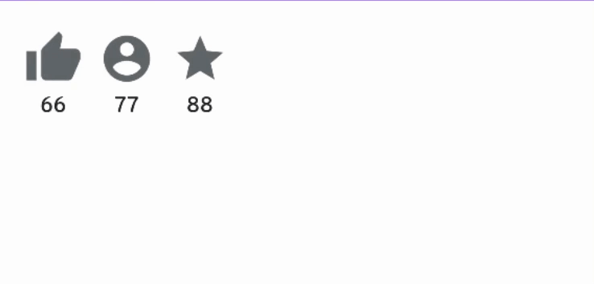

## 循序渐进的讲解用Android Jetpack Compose 写一个B站“一键三连”按钮动画

### 0. 效果



### 1. 知识拆解

从本文你可以学习到以下知识点:

- 如何快速学会用Compose进行布局
- 理解`Composeable`函数中数据驱动UI的编程思想, 理解`remember`函数的作用
- 理解函数副作用, 编写动画

#### 1.1 布局

“一键三连”由三个部分构成: 点赞及点赞数、投币及投币数和收藏及收藏数, 三个部分横向排布, 因此可以用`Row`来包裹

```kotlin
Row {
  点赞组件
  投币组件
  收藏组件
}
```

以点赞为例, 它是上下结构, 且数字对齐于图标, 在传统`Android View`体系中, 我们很快会想到约束布局然后使其左边对齐左边👈, 右边对其右边👉, 庆幸的是Compose中也有`constraintlayout-compose`库, 所以我们引入该库

```groovy
implementation "androidx.constraintlayout:constraintlayout-compose:1.0.1"
```

该库与我们以前使用约束布局时的思想是一样的:

1. 用`ConstraintLayout`包裹子元素
2. 给每个子元素生成id, 此处叫`createRefs`创建引用
3. 将子元素对其`parent`, 子元素之间再按需对齐

```kotlin
ConstraintLayout {
  // 给点赞图标、数量文本创建引用, 此处使用了解构声明语法
  val (refThumb, refCounter) = createRefs()
  // 将点赞图标引用的左、上、右对齐`parent`的左、上、右边
  Icon(modifier = Modifier.constrainAs(refThumb) {
      							start.linkTo(parent.start)
							      top.linkTo(parent.top)
							      end.linkTo(parent.end)
               		})
  // 将文本引用的左右两边对其`parent`，将顶部对齐图标的底部
  Text(modifier = Modifier.constrainAs(refCounter) {
                        start.linkTo(parent.start)
                        end.linkTo(parent.end)
                        top.linkTo(refThumb.bottom)
                  })
}
```

再如法炮制投币和收藏组件，这样"一键三连"就布局好了

```kotlin
Row {
  ConstraintLayout {
    Icon()
    Text()
  }
  ConstraintLayout {
    Icon()
    Text()
  }
  ConstraintLayout {
    Icon()
    Text()
  }
}
```

#### 1.2 用状态驱动UI

在我们传统的`Android View`体系中，我们给TextView设置文本一般这么做：

1. 找到这个view: `textView = findViewId(id)`

1. 设置view的属性: `textView.setText("67")`

> 而在compose UI编程中，状态指明了UI的当前属性，状态改变UI随之改变。用一个表达式表示为:
>
> ```
> UI = composable(state)
> ```

因此，

1. 我们通过`remember`声明一个状态，它表示会变化的文本内容, 并且它**可以跨越composable函数的重组阶段而不被重新初始化**(这是关键)：

```
var thumbCount by remember { mutableStateOf(66) }
```

2. 将状态设置给Text：

```
Text(thumbCount.toString())
```

3. 改变状态，composable函数会进行重组，从而自动改变文本内容

```kotlin
Text(thumbCount.toString(), modifier = Modifier.clickable {
																// 点击时将数量+1
					                      thumbCount = thumbCount + 1
          				          })
```

#### 1.3 设置长按事件，绘制动画

“一键三连”时，长按时开始出现圆弧进度条，并且随着时间圆弧扫过的角度从0-360°， 直到变成完整的圆圈⭕️，它有以下属性

1. 圆弧增长是连续的，或者说看似连续的， 每一小段时间就增长一点圆弧角度
2. `圆弧角度`是一个状态，因为他不能因为函数重组而被重新初始化
3. 动画是可以被打断的且被反转的，松手后不再增加角度而是减小角度，因此`圆弧角度的变化`可以被放在一个协程中运行， 因为它可以很容易被取消并重新开始

```kotlin
// 三连进度 从0到-360度，逆时针
var hitProgress by remember { mutableStateOf(0) }
var hitJob by remember { mutableStateOf<Job?>(null) }
	...
	// 触摸事件: ACTION_DOWN
	hitJob?.cancel()
	hitJob = scope.async {
		// 手指按下后，逐步减少hitProgress，使圆弧角度逆时针增加
    while (hitProgress > -360) {
     	delay(15)
     	hitProgress -= 4
    }
  }
  ...
  // 触摸事件: ACTION_UP
  hitJob?.cancel()
	hitJob = scope.async {
	   // 手指抬起时， 增加hitProgress，使圆弧逐步缩短
     while (hitProgress < 0) {
     	 delay(8)
       hitProgress += 4
     }
	}

...

// 画一段圆弧，从-90度开始，扫过hitProgress的角度, 圆弧的弧长会自动跟随hitProgress的变化而变化
drawArc(
  startAngle = -90f,
  sweepAngle = hitProgress.toFloat(),
)
```

### 2. 总结

通过以上的例子，我们可以发现，compose相比传统view在布局、动画方面会更为快速便捷。但也与view体系有很大的不同，主要体现在:

1. 无法拿到view对象，来改变自身属性，而是通过`状态依赖`来驱动自身属性
2. 动画的实现通过`函数副作用`来实现，它又与协程联系紧密


[源码地址: Github](https://github.com/Joehaivo/bilibili-thumb-up-compose)
